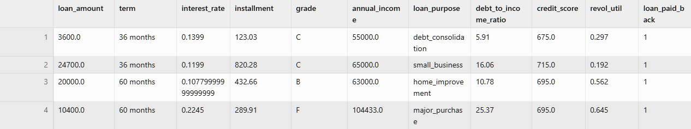

# EDA — LendingClub Credit Risk

The raw dataset covers LendingClub accepted loans from 2007 to 2018, with just over 2.2 million 
rows and 151 columns. EDA was run on a 100k sample using `src/scripts/feature_analysis.py`.

---

## What Features Did We Pick?

Out of 151 columns, most were immediately unusable — half had significant missing data, several 
were perfectly correlated duplicates of each other, and three had zero variance (the same value 
in every row). After filtering those out, the goal was to keep only features that:

- Are known at the time of the loan application (no post-origination data)
- Have no fair lending issues (no demographic fields — see note below)
- Are actually available and clean in the raw dataset

That left 10 features for the prototype:

| # | Feature | What it captures |
|---|---|---|
| 1 | `loan_amount` | How much the borrower wants |
| 2 | `annual_income` | Their ability to repay (heavily skewed — log-transformed) |
| 3 | `debt_to_income_ratio` | How much of their income is already committed to debt |
| 4 | `credit_score` | Their credit history in one number (FICO low end) |
| 5 | `interest_rate` | LendingClub's own risk assessment baked into the rate they offered |
| 6 | `installment` | The actual monthly payment — a direct affordability test |
| 7 | `revol_util` | How much of their available credit they're already using |
| 8 | `grade` | LendingClub's A–G risk tier — a strong categorical signal |
| 9 | `term` | 36 vs 60 months — longer loans default more often |
| 10 | `loan_purpose` | Why they need the money (debt consolidation vs. small business, etc.) |

The target is `loan_paid_back`: 1 if the loan was fully paid, 0 if it was charged off. Loans 
still in progress (`Current`, `Late`, `In Grace Period`) are dropped — we only want resolved 
outcomes.

---

## How the Data Gets Cleaned

`build_training_set()` in `src/lending_club_etl.py` handles everything:

1. Read the 10 relevant columns from the raw 1.6 GB CSV
2. Drop any loan that isn't resolved (keep only Fully Paid / Charged Off)
3. Fix formatting issues — `int_rate` and `revol_util` come as strings like `"10.5%"`, term has a leading space
4. Fill in the small number of missing values (median for numbers, mode for categories)
5. Drop duplicates
6. Rename columns to readable names
7. Save to `dataset/train.csv`

---

## Things We Found in the Data

**Half the columns were useless.** 73 of 151 had missing values. The worst offenders — all 
`sec_app_*` fields (joint application data) and `member_id` — were 100% empty. Another 20+ 
columns were more than half missing. All dropped.

**Some columns told the exact same story.** `loan_amnt`, `funded_amnt`, and `funded_amnt_inv` 
are perfectly correlated (r = 1.0) — they're three ways of saying the same number. Same with 
`fico_range_low` and `fico_range_high`. When two features carry identical information, one of 
them is just noise.

**Income data is extremely skewed.** `annual_inc` has a skewness of 51.8 — a handful of very 
high earners stretches the scale so far it distorts the model. `log1p` transformation brings 
it back to a usable distribution.

**Sub-grade is redundant.** LendingClub's `sub_grade` (35 levels like A1, B3, C5) is just a 
finer version of `grade` (7 levels A–G). The extra granularity isn't worth the encoding 
complexity for a prototype.

---

## What We Left Out and Why

| Excluded | Reason |
|---|---|
| `gender`, `marital_status` | Illegal to use in credit decisions (see ECOA below) |
| `sub_grade` | Redundant with `grade` |
| `emp_title` | 37,529 unique job titles — needs NLP to be useful |
| `funded_amnt`, `funded_amnt_inv` | Identical to `loan_amnt` |
| `fico_range_high` | Identical to `fico_range_low` |
| `total_pymnt`, `recoveries`, `last_pymnt_amnt` | Post-origination data — the loan outcome is already known by the time these exist, which would leak the answer to the model |

> **ECOA (Equal Credit Opportunity Act):** US federal law prohibiting the use of protected 
> characteristics — sex, marital status, race, religion, age — in credit decisions. Using them 
> in a model, even indirectly, exposes lenders to regulatory fines and litigation.